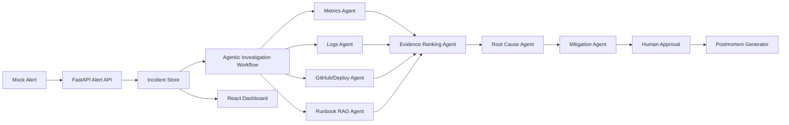

# Agentic AI Incident Commander

An end-to-end agentic AI project that investigates a production incident for an e-commerce checkout API. The system ingests a mock alert, gathers evidence from metrics, logs, deployment history, GitHub commits, and runbooks, ranks root-cause hypotheses, recommends mitigations, waits for human approval, simulates mitigation execution, verifies recovery, resolves the incident, and finalizes a postmortem.

## Final Status

- Deployment-ready local stack with Docker Compose.
- Real LangGraph workflow with 9 specialist agent nodes.
- 9 API-connected dashboard views based on Stitch designs.
- 38 automated tests and deterministic eval score of `0.976`.
- PostgreSQL/pgvector-ready persistence and hybrid runbook RAG.
- Optional Ollama support with deterministic fallback for free, stable demos.

## Problem

During production incidents, engineers lose time switching between observability dashboards, logs, deploy records, GitHub commits, runbooks, and team updates. The hard part is not seeing one alert; it is correlating multiple signals quickly enough to make a safe mitigation decision.

## Solution

This project acts like an AI incident commander. The current build uses a deterministic LangGraph workflow of specialist agents to investigate a checkout/payment latency incident and produce an evidence-backed recommendation. The deployment-ready upgrade path adds PostgreSQL/pgvector, Redis, Ollama, Docker Compose, Prometheus/Grafana, and GitHub Actions without requiring paid AWS services.

## Why This Is Agentic

- It has a multi-step workflow, not a single prompt.
- Each agent has a specific responsibility: alert intake, metrics, logs, deploy/GitHub, runbook RAG, evidence ranking, root cause, mitigation, and approval.
- It uses tool-like data sources: mock Prometheus metrics, log fixtures, deployment history, GitHub commit data, and runbook documents.
- It maintains incident state across the workflow.
- It pauses for human approval before recording mitigation.
- It simulates the approved mitigation and compares before/after telemetry.
- It requires recovery verification before a human can resolve the incident.
- It generates draft and final postmortems from the actual incident timeline and evidence.

## MVP Scenario

The demo incident is a critical checkout/payment API degradation:

- Checkout API p95 latency spikes.
- Payment failures rise.
- DB connection pool usage reaches 98 percent.
- Logs show `DB_POOL_EXHAUSTED` and `PAYMENT_AUTH_TIMEOUT`.
- A recent checkout deployment changed payment retry behavior.
- Runbooks explain DB pool saturation, checkout latency triage, payment timeout handling, and rollback steps.

## Current MVP Stack

- Backend: FastAPI, Pydantic, Uvicorn, SQLAlchemy, Alembic
- Agent workflow: real LangGraph state graph orchestration
- Retrieval: hybrid keyword/vector RAG over local Markdown runbooks
- Ranking: evidence scoring by service match, time proximity, severity, and source agreement
- Frontend: React, Vite, Stitch-derived UI, Material Symbols
- Persistence: SQLAlchemy repository with Alembic migrations for incidents, approvals, executions, recovery checks, and reports, plus in-memory fallback for tests
- Embeddings: deterministic local hash embeddings by default, SentenceTransformers optional
- LLM generation: deterministic local provider by default, Ollama optional
- Observability: JSON request logs, request IDs, Prometheus metrics, Grafana dashboard
- Testing and evals: pytest, deterministic demo evaluation script

## Deployment-Ready Target Stack

- Frontend: React, Vite, TypeScript, React Router, TanStack Query, Recharts
- Backend: FastAPI, Pydantic, SQLAlchemy, Alembic, Uvicorn
- Agentic AI: LangGraph, checkpointing, human-in-the-loop approval nodes, agent trace persistence
- LLM: Ollama locally, with optional free hosted fallback through Groq, Gemini, or OpenRouter
- Embeddings: SentenceTransformers
- RAG: PostgreSQL + pgvector, hybrid keyword plus vector retrieval
- Cache: Redis
- Observability: Prometheus, Grafana, structured logs
- Deployment: Docker Compose
- CI/CD: GitHub Actions

Detailed stack doc: [docs/free-deployment-stack.md](docs/free-deployment-stack.md)

Deployment-ready 1-week schedule: [docs/deployment-ready-1-week-schedule.md](docs/deployment-ready-1-week-schedule.md)

Final portfolio summary: [docs/final-portfolio-summary.md](docs/final-portfolio-summary.md)

Resume-ready bullets: [demo/resume-bullet.md](demo/resume-bullet.md)

## Architecture



## Project Structure

```text
backend/      FastAPI backend, models, store, workflow, retrieval, ranking
data/         Mock alerts, metrics, logs, deployments, commits, and runbooks
docs/         PRD, architecture, data-flow, user-flow, roadmap, portfolio summary
evals/        Deterministic checks for demo quality
frontend/     React/Vite dashboard based on Stitch screens
stitch/       Downloaded Stitch HTML/PNG design references
tests/        pytest suite for APIs, workflow, RAG, ranking, approvals, postmortem
demo/         Demo script and resume-ready project bullet
```

## Screenshots

Final screenshots captured from the running dashboard:

- [Incident Overview](demo/screenshots/incident-overview.png)
- [Alert Simulation Hub](demo/screenshots/alert-simulation-hub.png)
- [Investigation Detail](demo/screenshots/investigation-detail.png)
- [Agent Tracing & Debugging](demo/screenshots/agent-tracing-debugging.png)
- [System Health](demo/screenshots/system-health.png)
- [Runbook RAG Library](demo/screenshots/runbook-rag-library.png)
- [Incident Archive](demo/screenshots/incident-archive.png)
- [Team & Access Management](demo/screenshots/team-access-management.png)
- [Incident Postmortem](demo/screenshots/incident-postmortem.png)

## Run Locally

Install Python dependencies from the project root:

```powershell
pip install -r requirements.txt
```

Start the backend:

```powershell
uvicorn backend.app.main:app --host 127.0.0.1 --port 8000 --reload
```

Install and start the frontend:

```powershell
cd frontend
npm.cmd install
npm.cmd run dev
```

Open the dashboard:

```text
http://127.0.0.1:5173
```

FastAPI docs:

```text
http://127.0.0.1:8000/docs
```

## Docker Compose Stack

Day 5 adds a full local stack:

- API: `http://127.0.0.1:8000`
- Frontend: `http://127.0.0.1:5173`
- PostgreSQL/pgvector: `127.0.0.1:5432`
- Redis: `127.0.0.1:6379`
- Prometheus: `http://127.0.0.1:9090`
- Grafana: `http://127.0.0.1:3000` with `admin` / `admin`

Start everything:

```powershell
docker compose up --build
```

Make sure Docker Desktop is running before executing the command.

The API container runs `alembic upgrade head`, seeds the demo incident, ingests runbook embeddings, and then starts Uvicorn. The default Compose path uses deterministic local generation and hash embeddings, so it does not require paid services or model downloads.

Optional Ollama container:

```powershell
docker compose --profile ollama up --build
```

## Database Persistence

The app defaults to in-memory mode for quick demos and deterministic tests. To use the database-backed store locally, run the migration and seed command:

```powershell
alembic upgrade head
python -m backend.app.seed_database
```

Then start the API with database mode enabled:

```powershell
$env:INCIDENT_STORE_BACKEND="database"
uvicorn backend.app.main:app --host 127.0.0.1 --port 8000 --reload
```

By default this uses local SQLite at `.local/incident_commander.db`. For PostgreSQL, set `DATABASE_URL` before running migrations and the API.

## Runbook Ingestion

Day 3 adds hybrid runbook retrieval. The ingestion command chunks the Markdown runbooks, creates embeddings, persists them through SQLAlchemy, and fills the pgvector column when `DATABASE_URL` points at PostgreSQL:

```powershell
python -m backend.app.ingest_runbooks
```

The default `EMBEDDING_PROVIDER=hash` is deterministic and free. To use SentenceTransformers locally, set:

```powershell
$env:EMBEDDING_PROVIDER="sentence_transformers"
$env:SENTENCE_TRANSFORMERS_MODEL="sentence-transformers/all-MiniLM-L6-v2"
python -m backend.app.ingest_runbooks
```

## Local LLM Mode

Day 4 adds an LLM provider layer for root-cause synthesis, mitigation explanation, and postmortem executive summaries. The default mode is deterministic and does not require a running model:

```powershell
$env:LLM_PROVIDER="deterministic"
```

To use Ollama locally:

```powershell
$env:LLM_PROVIDER="ollama"
$env:OLLAMA_BASE_URL="http://127.0.0.1:11434"
$env:OLLAMA_MODEL="llama3.1"
uvicorn backend.app.main:app --host 127.0.0.1 --port 8000 --reload
```

If Ollama is unavailable, the provider falls back to deterministic generation so tests and demos remain stable.

## Frontend Routes

Day 6 adds React Router and TanStack Query. The dashboard routes are:

- `/incidents`
- `/incidents/:id`
- `/simulation`
- `/traces`
- `/health`
- `/runbooks`
- `/archive`
- `/team`
- `/postmortem`

## Observability

The API emits structured JSON logs with `x-request-id` correlation and exposes Prometheus metrics at:

```text
http://127.0.0.1:8000/metrics
```

Tracked signals include alert ingestion, workflow duration, agent step duration, evidence count, approval decisions, postmortem generation, and HTTP request metrics.

## Demo Flow

1. Open the dashboard and review the active checkout incident.
2. Go to Investigation and inspect agent steps, evidence, root cause, and mitigation ranking.
3. Approve the rollback recommendation or request more investigation.
4. Execute the approved mitigation simulation and inspect before/after telemetry.
5. Run recovery verification and resolve the incident.
6. Open the Postmortem view and review the final Markdown report.
7. Open Runbooks to show how RAG context supports the recommendation.
8. Open System Health to show service-level impact.

Detailed script: [demo/demo-script.md](demo/demo-script.md)

## Verification

Run backend tests:

```powershell
pytest -q
```

Run deterministic evals:

```powershell
python -m evals.evaluate_demo
```

Build frontend:

```powershell
cd frontend
npm.cmd run build
```

Validate Docker Compose:

```powershell
docker compose config
```

## Implemented Scope

- MVP Day 1 to Day 7: fixtures, FastAPI APIs, agent workflow, runbook retrieval, Stitch-derived frontend, approval lifecycle, postmortems, tests, evals, README, and demo script
- Deployment Day 1: real LangGraph state graph conversion
- Deployment Day 2: SQLAlchemy repository, Alembic migration, database seed command, and test-friendly fallback mode
- Deployment Day 3: pgvector-ready migration, embedding provider layer, runbook ingestion command, and hybrid keyword/vector RAG
- Deployment Day 4: LLM provider abstraction, Ollama adapter, deterministic fallback mode, and prompt templates
- Deployment Day 5: Dockerfiles, Docker Compose stack, PostgreSQL/pgvector, Redis, Prometheus, Grafana, health checks, and startup seeding
- Deployment Day 6: structured logs, request IDs, Prometheus metrics, Grafana dashboard, React Router, TanStack Query hooks, and GitHub Actions CI
- Lifecycle completion: persisted mitigation execution, recovery verification, human resolution, and draft/final postmortems

## Limitations

- Observability, GitHub, and deployment data are mocked for a stable local demo.
- Mitigation execution changes only simulated incident state and telemetry; it does not modify a GitHub repository, deployment, database configuration, or real infrastructure.
- The current workflow is deterministic to make interview demos repeatable.
- The database path is implemented through SQLAlchemy/Alembic; Dockerized PostgreSQL is scheduled for the deployment stack.
- The current RAG layer has hybrid scoring; pgvector similarity is activated when running against PostgreSQL.
- Ollama generation is optional; deterministic generation is the default to avoid local model requirements.
- Authentication, Slack/PagerDuty, Kubernetes, and real production integrations remain future upgrades.
- AWS is intentionally avoided to keep the project free to run.

## Resume Bullet

Built a deployment-ready agentic incident response platform using LangGraph, FastAPI, React, PostgreSQL/pgvector, Ollama, Docker Compose, Prometheus/Grafana, runbook RAG, human-in-the-loop approvals, deterministic evals, and automated postmortem generation for e-commerce API incidents.
