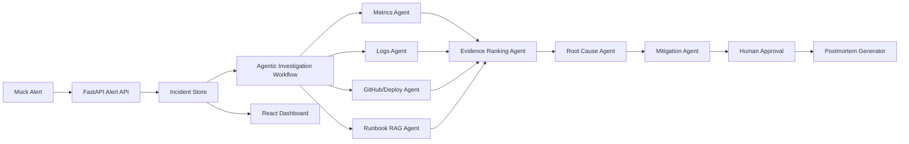

# Agentic AI Incident Commander

An end-to-end agentic AI project that investigates a production incident for an e-commerce checkout API. The system ingests a mock alert, gathers evidence from metrics, logs, deployment history, GitHub commits, and runbooks, ranks root-cause hypotheses, recommends mitigations, waits for human approval, and generates a postmortem.

## Problem

During production incidents, engineers lose time switching between observability dashboards, logs, deploy records, GitHub commits, runbooks, and team updates. The hard part is not seeing one alert; it is correlating multiple signals quickly enough to make a safe mitigation decision.

## Solution

This project acts like an AI incident commander. The current build uses a deterministic LangGraph workflow of specialist agents to investigate a checkout/payment latency incident and produce an evidence-backed recommendation. The deployment-ready upgrade path adds PostgreSQL/pgvector, Redis, Ollama, Docker Compose, Prometheus/Grafana, and GitHub Actions without requiring paid AWS services.

## Why This Is Agentic

- It has a multi-step workflow, not a single prompt.
- Each agent has a specific responsibility: alert intake, metrics, logs, deploy/GitHub, runbook RAG, evidence ranking, root cause, mitigation, and approval.
- It uses tool-like data sources: mock Prometheus metrics, log fixtures, deployment history, GitHub commit data, and runbook documents.
- It maintains incident state across the workflow.
- It pauses for human approval before recording mitigation.
- It generates a postmortem from the actual incident timeline and evidence.

## MVP Scenario

The demo incident is a critical checkout/payment API degradation:

- Checkout API p95 latency spikes.
- Payment failures rise.
- DB connection pool usage reaches 98 percent.
- Logs show `DB_POOL_EXHAUSTED` and `PAYMENT_AUTH_TIMEOUT`.
- A recent checkout deployment changed payment retry behavior.
- Runbooks explain DB pool saturation, checkout latency triage, payment timeout handling, and rollback steps.

## Current MVP Stack

- Backend: FastAPI, Pydantic, Uvicorn, SQLAlchemy, Alembic
- Agent workflow: real LangGraph state graph orchestration
- Retrieval: hybrid keyword/vector RAG over local Markdown runbooks
- Ranking: evidence scoring by service match, time proximity, severity, and source agreement
- Frontend: React, Vite, Stitch-derived UI, Material Symbols
- Persistence: SQLAlchemy repository with Alembic migrations, plus in-memory fallback for tests
- Embeddings: deterministic local hash embeddings by default, SentenceTransformers optional
- Testing and evals: pytest, deterministic demo evaluation script

## Deployment-Ready Target Stack

- Frontend: React, Vite, TypeScript, React Router, TanStack Query, Recharts
- Backend: FastAPI, Pydantic, SQLAlchemy, Alembic, Uvicorn
- Agentic AI: LangGraph, checkpointing, human-in-the-loop approval nodes, agent trace persistence
- LLM: Ollama locally, with optional free hosted fallback through Groq, Gemini, or OpenRouter
- Embeddings: SentenceTransformers
- RAG: PostgreSQL + pgvector, hybrid keyword plus vector retrieval
- Cache: Redis
- Observability: Prometheus, Grafana, structured logs
- Deployment: Docker Compose
- CI/CD: GitHub Actions

Detailed stack doc: [docs/free-deployment-stack.md](docs/free-deployment-stack.md)

Deployment-ready 1-week schedule: [docs/deployment-ready-1-week-schedule.md](docs/deployment-ready-1-week-schedule.md)

## Architecture



## Project Structure

```text
backend/      FastAPI backend, models, store, workflow, retrieval, ranking
data/         Mock alerts, metrics, logs, deployments, commits, and runbooks
docs/         PRD, architecture, data-flow, user-flow, roadmap, portfolio summary
evals/        Deterministic checks for demo quality
frontend/     React/Vite dashboard based on Stitch screens
stitch/       Downloaded Stitch HTML/PNG design references
tests/        pytest suite for APIs, workflow, RAG, ranking, approvals, postmortem
demo/         Demo script and resume-ready project bullet
```

## Run Locally

Install Python dependencies from the project root:

```powershell
pip install -r requirements.txt
```

Start the backend:

```powershell
uvicorn backend.app.main:app --host 127.0.0.1 --port 8000 --reload
```

Install and start the frontend:

```powershell
cd frontend
npm.cmd install
npm.cmd run dev
```

Open the dashboard:

```text
http://127.0.0.1:5173
```

FastAPI docs:

```text
http://127.0.0.1:8000/docs
```

## Database Persistence

The app defaults to in-memory mode for quick demos and deterministic tests. To use the database-backed store locally, run the migration and seed command:

```powershell
alembic upgrade head
python -m backend.app.seed_database
```

Then start the API with database mode enabled:

```powershell
$env:INCIDENT_STORE_BACKEND="database"
uvicorn backend.app.main:app --host 127.0.0.1 --port 8000 --reload
```

By default this uses local SQLite at `.local/incident_commander.db`. For PostgreSQL, set `DATABASE_URL` before running migrations and the API.

## Runbook Ingestion

Day 3 adds hybrid runbook retrieval. The ingestion command chunks the Markdown runbooks, creates embeddings, persists them through SQLAlchemy, and fills the pgvector column when `DATABASE_URL` points at PostgreSQL:

```powershell
python -m backend.app.ingest_runbooks
```

The default `EMBEDDING_PROVIDER=hash` is deterministic and free. To use SentenceTransformers locally, set:

```powershell
$env:EMBEDDING_PROVIDER="sentence_transformers"
$env:SENTENCE_TRANSFORMERS_MODEL="sentence-transformers/all-MiniLM-L6-v2"
python -m backend.app.ingest_runbooks
```

## Demo Flow

1. Open the dashboard and review the active checkout incident.
2. Go to Investigation and inspect agent steps, evidence, root cause, and mitigation ranking.
3. Approve the rollback recommendation or request more investigation.
4. Open the Postmortem view and review the generated Markdown report.
5. Open Runbooks to show how RAG context supports the recommendation.
6. Open System Health to show service-level impact.

Detailed script: [demo/demo-script.md](demo/demo-script.md)

## Verification

Run backend tests:

```powershell
pytest -q
```

Run deterministic evals:

```powershell
python -m evals.evaluate_demo
```

Build frontend:

```powershell
cd frontend
npm.cmd run build
```

## Implemented Scope

- MVP Day 1 to Day 7: fixtures, FastAPI APIs, agent workflow, runbook retrieval, Stitch-derived frontend, approval lifecycle, postmortems, tests, evals, README, and demo script
- Deployment Day 1: real LangGraph state graph conversion
- Deployment Day 2: SQLAlchemy repository, Alembic migration, database seed command, and test-friendly fallback mode
- Deployment Day 3: pgvector-ready migration, embedding provider layer, runbook ingestion command, and hybrid keyword/vector RAG

## Limitations

- Observability, GitHub, and deployment data are mocked for a stable local demo.
- The current workflow is deterministic to make interview demos repeatable.
- The database path is implemented through SQLAlchemy/Alembic; Dockerized PostgreSQL is scheduled for the deployment stack.
- The current RAG layer has hybrid scoring; pgvector similarity is activated when running against PostgreSQL.
- Authentication, Slack/PagerDuty, Kubernetes, and real production integrations remain future upgrades.
- AWS is intentionally avoided to keep the project free to run.

## Resume Bullet

Built a deployment-ready agentic incident response platform using LangGraph, FastAPI, React, PostgreSQL/pgvector, Ollama, Docker Compose, Prometheus/Grafana, runbook RAG, human-in-the-loop approvals, deterministic evals, and automated postmortem generation for e-commerce API incidents.
