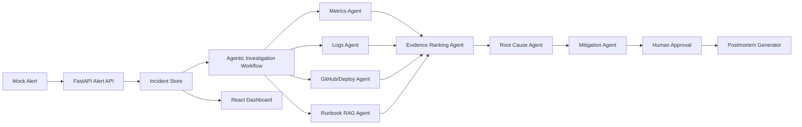

# Agentic AI Incident Commander

An end-to-end agentic AI project that investigates a production incident for an e-commerce checkout API. The system ingests a mock alert, gathers evidence from metrics, logs, deployment history, GitHub commits, and runbooks, ranks root-cause hypotheses, recommends mitigations, waits for human approval, and generates a postmortem.

## Problem

During production incidents, engineers lose time switching between observability dashboards, logs, deploy records, GitHub commits, runbooks, and team updates. The hard part is not seeing one alert; it is correlating multiple signals quickly enough to make a safe mitigation decision.

## Solution

This project acts like an AI incident commander. It uses a deterministic LangGraph-style workflow of specialist agents to investigate a checkout/payment latency incident and produce an evidence-backed recommendation. Risky actions are human-approved before the incident state changes.

## Why This Is Agentic

- It has a multi-step workflow, not a single prompt.
- Each agent has a specific responsibility: alert intake, metrics, logs, deploy/GitHub, runbook RAG, evidence ranking, root cause, mitigation, and approval.
- It uses tool-like data sources: mock Prometheus metrics, log fixtures, deployment history, GitHub commit data, and runbook documents.
- It maintains incident state across the workflow.
- It pauses for human approval before recording mitigation.
- It generates a postmortem from the actual incident timeline and evidence.

## MVP Scenario

The demo incident is a critical checkout/payment API degradation:

- Checkout API p95 latency spikes.
- Payment failures rise.
- DB connection pool usage reaches 98 percent.
- Logs show `DB_POOL_EXHAUSTED` and `PAYMENT_AUTH_TIMEOUT`.
- A recent checkout deployment changed payment retry behavior.
- Runbooks explain DB pool saturation, checkout latency triage, payment timeout handling, and rollback steps.

## Tech Stack

- Backend: FastAPI, Pydantic, Uvicorn
- Agent workflow: deterministic LangGraph-style orchestration
- Retrieval: keyword-based RAG over local Markdown runbooks
- Ranking: evidence scoring by service match, time proximity, severity, and source agreement
- Frontend: React, Vite, Stitch-derived UI, Material Symbols
- Persistence: in-memory MVP store seeded from JSON and Markdown fixtures
- Testing and evals: pytest, deterministic demo evaluation script

## Architecture



## Project Structure

```text
backend/      FastAPI backend, models, store, workflow, retrieval, ranking
data/         Mock alerts, metrics, logs, deployments, commits, and runbooks
docs/         PRD, architecture, data-flow, user-flow, roadmap, portfolio summary
evals/        Deterministic checks for demo quality
frontend/     React/Vite dashboard based on Stitch screens
stitch/       Downloaded Stitch HTML/PNG design references
tests/        pytest suite for APIs, workflow, RAG, ranking, approvals, postmortem
demo/         Demo script and resume-ready project bullet
```

## Run Locally

Install Python dependencies from the project root:

```powershell
pip install -r requirements.txt
```

Start the backend:

```powershell
uvicorn backend.app.main:app --host 127.0.0.1 --port 8000 --reload
```

Install and start the frontend:

```powershell
cd frontend
npm.cmd install
npm.cmd run dev
```

Open the dashboard:

```text
http://127.0.0.1:5173
```

FastAPI docs:

```text
http://127.0.0.1:8000/docs
```

## Demo Flow

1. Open the dashboard and review the active checkout incident.
2. Go to Investigation and inspect agent steps, evidence, root cause, and mitigation ranking.
3. Approve the rollback recommendation or request more investigation.
4. Open the Postmortem view and review the generated Markdown report.
5. Open Runbooks to show how RAG context supports the recommendation.
6. Open System Health to show service-level impact.

Detailed script: [demo/demo-script.md](C:/Users/User/Documents/Demo%20Project/demo/demo-script.md)

## Verification

Run backend tests:

```powershell
pytest -q
```

Run deterministic evals:

```powershell
python -m evals.evaluate_demo
```

Build frontend:

```powershell
cd frontend
npm.cmd run build
```

## Implemented Scope

- Day 1: project setup and fixtures
- Day 2: FastAPI backend
- Day 3: agentic investigation workflow
- Day 4: runbook retrieval and evidence ranking
- Day 5: Stitch-derived frontend connected to backend APIs
- Day 6: approval lifecycle, postmortem generation, tests, evals
- Day 7: README, demo script, architecture summary, resume bullet, verification

## Limitations

- Observability, GitHub, and deployment data are mocked for a stable local demo.
- The workflow is deterministic to make interview demos repeatable.
- Persistence is in-memory; PostgreSQL is the production upgrade path.
- RAG uses lightweight keyword retrieval; production can add embeddings and a vector database later if desired.
- Authentication, Slack/PagerDuty, Kubernetes, CI/CD, and real Prometheus/Grafana integrations are future upgrades.

## Resume Bullet

Built an agentic incident response platform for e-commerce API outages using FastAPI, React, LangGraph-style multi-agent orchestration, runbook RAG, log/metric/deployment analysis, evidence ranking, human-in-the-loop approvals, deterministic evals, and automated postmortem generation across a 9-step incident workflow.
