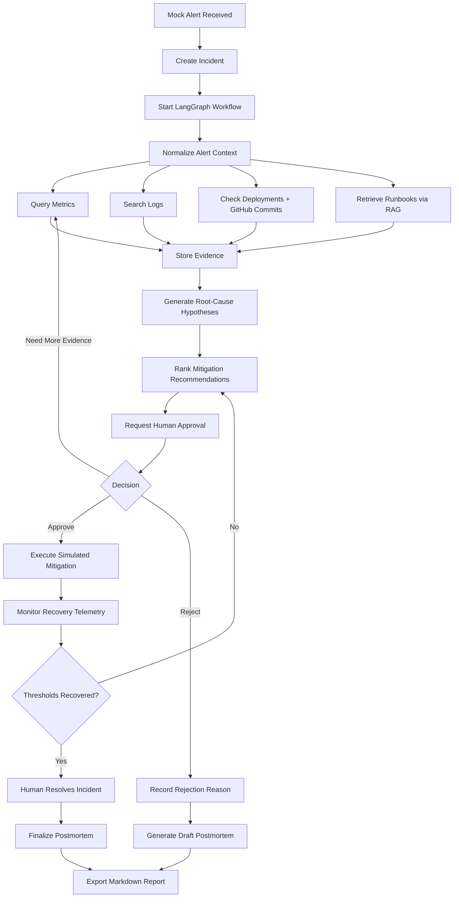
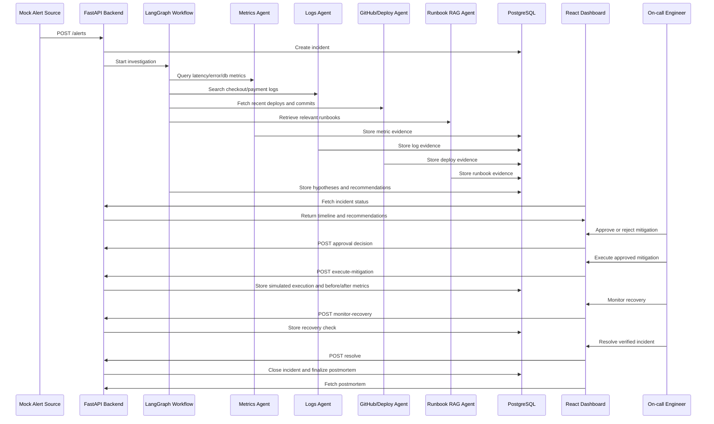

# Data Flow

## 1. Data Flow Summary

The system receives a checkout/payment API alert, creates an incident, and starts a LangGraph investigation. Specialist agents gather evidence from logs, metrics, deployments, GitHub commits, and runbooks. The current MVP uses local fixtures; the deployment-ready target persists state in PostgreSQL and retrieves runbook context through pgvector-backed RAG.

## 2. Full Incident Lifecycle



## 3. Sequence Flow



## 4. Main Data Objects

### Alert

Represents the incoming incident trigger.

Fields:

- `id`
- `source`
- `service`
- `severity`
- `metric_name`
- `metric_value`
- `threshold`
- `started_at`
- `description`
- `raw_payload`

Example:

```json
{
  "source": "mock_datadog",
  "service": "checkout-api",
  "severity": "critical",
  "metric_name": "p95_latency_ms",
  "metric_value": 2400,
  "threshold": 800,
  "description": "Checkout p95 latency exceeded threshold and payment failures increased."
}
```

### Incident

Tracks the full lifecycle of an investigation.

Fields:

- `id`
- `title`
- `status`
- `severity`
- `affected_service`
- `created_at`
- `updated_at`
- `current_stage`
- `summary`

Allowed incident statuses:

- `new`
- `investigating`
- `waiting_for_approval`
- `mitigation_recorded`
- `mitigation_executing`
- `recovery_monitoring`
- `ready_to_resolve`
- `closed`

### Evidence

Stores observations collected by agents.

Fields:

- `id`
- `incident_id`
- `source_type`
- `source_name`
- `timestamp`
- `summary`
- `raw_reference`
- `confidence`
- `relevance_score`

Source types:

- `metric`
- `log`
- `deployment`
- `github_commit`
- `runbook`
- `trace`
- `human_decision`

### RunbookChunk

Represents indexed runbook content in PostgreSQL/pgvector.

Fields:

- `id`
- `runbook_title`
- `section_title`
- `content`
- `embedding`
- `tags`
- `service`
- `updated_at`

### Hypothesis

Represents an evidence-backed root-cause theory.

Fields:

- `id`
- `incident_id`
- `title`
- `description`
- `confidence`
- `supporting_evidence_ids`
- `contradicting_evidence_ids`
- `unknowns`

Example:

```json
{
  "title": "Database connection pool saturation after checkout deployment",
  "confidence": 0.82,
  "description": "Checkout latency increased shortly after deployment v1.42.0, while DB pool usage reached 98% and logs show DB_POOL_EXHAUSTED errors."
}
```

### MitigationRecommendation

Represents a proposed response.

Fields:

- `id`
- `incident_id`
- `hypothesis_id`
- `action_type`
- `title`
- `description`
- `risk_level`
- `confidence`
- `requires_approval`
- `expected_impact`

Action types:

- `rollback`
- `scale_resource`
- `disable_feature_flag`
- `provider_failover`
- `monitor_only`

### ApprovalDecision

Captures human-in-the-loop control.

Fields:

- `id`
- `incident_id`
- `recommendation_id`
- `decision`
- `decided_by`
- `reason`
- `created_at`

Allowed decisions:

- `approved`
- `rejected`
- `more_investigation_required`

### MitigationExecution

Records the approved action, simulated execution steps, execution status, and before/after telemetry. The current implementation is intentionally non-destructive and does not modify real infrastructure.

### RecoveryCheck

Stores measured post-change metrics, recovery thresholds, observations, and whether recovery was verified.

### Postmortem

Represents the generated incident report.

Fields:

- `id`
- `incident_id`
- `markdown`
- `generated_at`
- `root_cause_summary`
- `impact_summary`
- `follow_up_actions`
- `status`
- `finalized_at`

## 5. Evidence Ranking Logic

The system should rank evidence by:

- Time proximity to the alert.
- Match to affected service.
- Severity of observed anomaly.
- Agreement with other evidence sources.
- Runbook relevance score.

The root-cause agent should not rely on a single evidence source when multiple sources are available.

## 6. Postmortem Data Inputs

The postmortem agent uses:

- Original alert
- Incident status timeline
- Key evidence summaries
- Final root-cause hypothesis
- Mitigation recommendations
- Human approval decision
- Follow-up action list

The generated postmortem must be readable as a standalone Markdown report.
