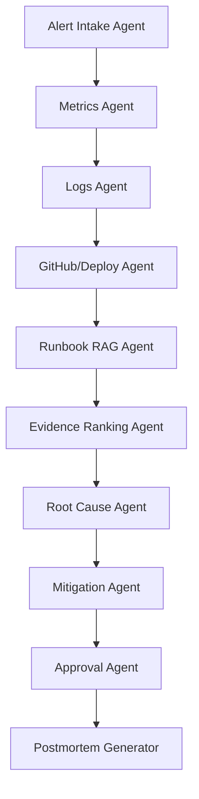

# Portfolio Architecture Summary

## System Purpose

Agentic AI Incident Commander helps engineers investigate production incidents faster by correlating alert, metric, log, deployment, GitHub, and runbook evidence into a root-cause hypothesis and mitigation recommendation.

## Core Components

- React dashboard: Stitch-derived interface for incident overview, investigation, system health, archive, runbooks, and postmortem.
- FastAPI backend: exposes incident, evidence, hypothesis, recommendation, approval, runbook, health, and postmortem APIs.
- PostgreSQL/pgvector target store: persists incidents, evidence, approvals, postmortems, runbook chunks, and embeddings.
- Redis target cache: supports workflow/session coordination.
- LangGraph target workflow: stateful graph with 9 specialist agent nodes, checkpointing, and human approval pauses.
- Runbook retriever: upgrades from local keyword retrieval to hybrid keyword plus pgvector retrieval.
- Evidence ranker: scores evidence by source, service relevance, time proximity, severity, and agreement.
- Postmortem generator: converts live incident state into a Markdown report.
- Eval harness: checks that the demo workflow has enough evidence, confidence, approval gating, and postmortem coverage.
- Ollama/free LLM provider layer: supports local LLM generation without AWS spend.
- Prometheus/Grafana target observability: exposes API and workflow metrics.

## Agent Workflow

## Backend API Surface

- `GET /health`
- `POST /alerts`
- `GET /incidents`
- `GET /incidents/{incident_id}`
- `GET /incidents/{incident_id}/timeline`
- `GET /incidents/{incident_id}/evidence`
- `GET /incidents/{incident_id}/hypotheses`
- `GET /incidents/{incident_id}/recommendations`
- `GET /incidents/{incident_id}/traces`
- `POST /incidents/{incident_id}/investigate`
- `POST /incidents/{incident_id}/approvals`
- `GET /incidents/{incident_id}/approvals`
- `GET /incidents/{incident_id}/postmortem`
- `GET /runbooks`
- `GET /system-health`
- `POST /dev/reset`

## What Makes It Credible

- It solves a recognizable engineering problem: production incident response.
- It uses multiple evidence sources rather than pretending a single LLM answer is enough.
- It keeps risky mitigation human-approved.
- It includes automated tests and deterministic eval checks.
- It has a UI that demonstrates the complete workflow end to end.
- The upgrade path uses real LangGraph, PostgreSQL/pgvector, Docker Compose, and observability tooling.

## Free Deployment-Ready Upgrade Path

- Replace the manual LangGraph-style workflow with real LangGraph.
- Replace in-memory store with PostgreSQL.
- Add pgvector and SentenceTransformers for runbook embeddings.
- Add Redis for workflow/session coordination.
- Add Ollama for local LLM support and optional Groq/Gemini/OpenRouter fallback.
- Add Docker Compose for API, frontend, PostgreSQL/pgvector, Redis, Prometheus, and Grafana.
- Add GitHub Actions for tests, evals, frontend build, and Docker validation.
- Replace mocked observability fixtures with Prometheus-compatible metrics, Grafana dashboards, or OpenTelemetry.
- Replace mocked GitHub/deploy data with GitHub API and CI/CD integrations.
- Add auth, RBAC, audit logging, and Slack/PagerDuty-style notifications later.
- Add LLM-backed summarization and model evaluation for generated hypotheses and postmortems.
