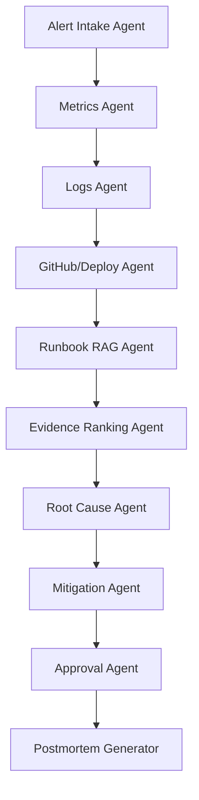

# Portfolio Architecture Summary

## System Purpose

Agentic AI Incident Commander helps engineers investigate production incidents faster by correlating alert, metric, log, deployment, GitHub, and runbook evidence into a root-cause hypothesis and mitigation recommendation.

## Core Components

- React dashboard: Stitch-derived interface for incident overview, investigation, system health, archive, runbooks, and postmortem.
- FastAPI backend: exposes incident, evidence, hypothesis, recommendation, approval, runbook, health, and postmortem APIs.
- In-memory incident store: keeps MVP state deterministic and easy to reset.
- Agentic workflow: deterministic LangGraph-style graph with 9 specialist agent nodes.
- Runbook retriever: searches local Markdown runbooks and returns relevant chunks as evidence.
- Evidence ranker: scores evidence by source, service relevance, time proximity, severity, and agreement.
- Postmortem generator: converts live incident state into a Markdown report.
- Eval harness: checks that the demo workflow has enough evidence, confidence, approval gating, and postmortem coverage.

## Agent Workflow

## Backend API Surface

- `GET /health`
- `POST /alerts`
- `GET /incidents`
- `GET /incidents/{incident_id}`
- `GET /incidents/{incident_id}/timeline`
- `GET /incidents/{incident_id}/evidence`
- `GET /incidents/{incident_id}/hypotheses`
- `GET /incidents/{incident_id}/recommendations`
- `GET /incidents/{incident_id}/traces`
- `POST /incidents/{incident_id}/investigate`
- `POST /incidents/{incident_id}/approvals`
- `GET /incidents/{incident_id}/approvals`
- `GET /incidents/{incident_id}/postmortem`
- `GET /runbooks`
- `GET /system-health`
- `POST /dev/reset`

## What Makes It Credible

- It solves a recognizable engineering problem: production incident response.
- It uses multiple evidence sources rather than pretending a single LLM answer is enough.
- It keeps risky mitigation human-approved.
- It includes automated tests and deterministic eval checks.
- It has a UI that demonstrates the complete workflow end to end.

## Production Upgrade Path

- Replace mocked observability fixtures with Prometheus, Grafana, Datadog, or OpenTelemetry.
- Replace mocked GitHub/deploy data with GitHub API and CI/CD integrations.
- Replace in-memory store with PostgreSQL.
- Add auth, RBAC, audit logging, Slack/PagerDuty notifications, and Kubernetes deployment.
- Add LLM-backed summarization and model evaluation for generated hypotheses and postmortems.
