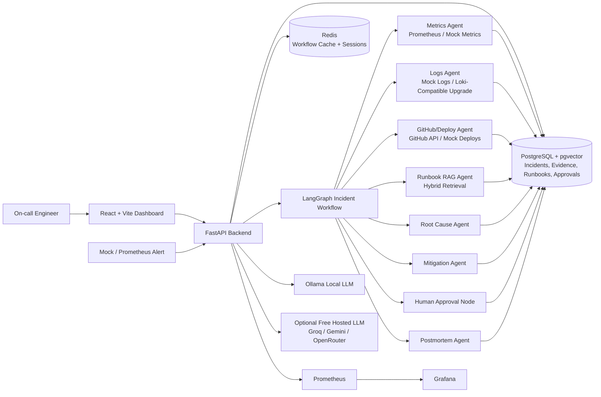
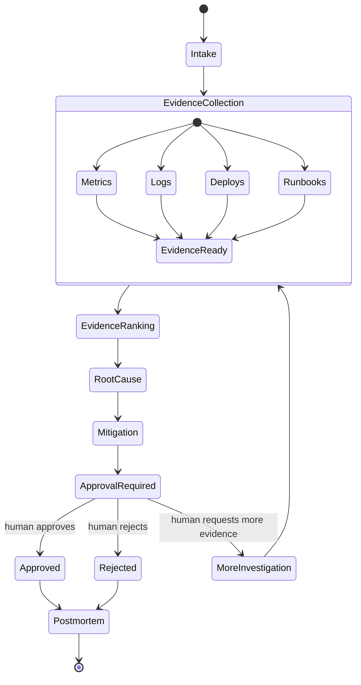

# System Design Architecture

## 1. Architecture Summary

Agentic AI Incident Commander is being upgraded from a local MVP into a free, deployment-ready incident response platform. The target system uses real LangGraph orchestration, FastAPI, React, PostgreSQL with pgvector, Redis, Ollama or free hosted LLM providers, Docker Compose, Prometheus/Grafana, and GitHub Actions.

The design remains local-first and cost-free. It should run end to end on a developer machine without AWS spend, while still looking credible from an industry architecture point of view.

## 2. Confirmed Free Deployment-Ready Stack

### Frontend

- React
- Vite
- TypeScript
- React Router
- TanStack Query
- Current Stitch-derived custom CSS
- Recharts for metric visualizations

### Backend

- Python
- FastAPI
- Pydantic
- SQLAlchemy
- Alembic
- Uvicorn

### Agentic AI

- LangGraph
- LangGraph state graph for incident investigation
- LangGraph checkpointing for workflow persistence
- Human-in-the-loop approval node
- Agent trace persistence
- Deterministic fallback mode for stable demos

### LLM And Embeddings

- Ollama for local inference
- Recommended local models:
  - `llama3.1`
  - `mistral`
  - `qwen2.5`
  - `gemma2`
- SentenceTransformers for local embeddings
- Optional free hosted fallback:
  - Groq free tier
  - Google Gemini free tier
  - OpenRouter free tier where available

### RAG And Storage

- PostgreSQL
- pgvector
- Hybrid keyword plus vector retrieval
- Local Markdown runbook ingestion
- Evidence ranking by source, time proximity, service match, severity, and source agreement

### Infrastructure

- Docker
- Docker Compose
- Redis for workflow/session cache and background coordination
- Prometheus for metrics
- Grafana for dashboards
- GitHub Actions for CI/CD checks

## 3. High-Level Architecture

## 4. Core Services

### Alert Ingestion API

Receives alert payloads and creates incident records.

Primary endpoints:

- `POST /alerts`: ingest an alert and start investigation.
- `GET /incidents`: list incidents.
- `GET /incidents/{incident_id}`: fetch incident details.
- `GET /incidents/{incident_id}/timeline`: fetch investigation timeline.

### LangGraph Investigation Orchestrator

Runs the stateful incident workflow for each incident.

Responsibilities:

- Maintain shared incident state.
- Call each specialist agent in a controlled graph.
- Persist intermediate evidence, hypotheses, recommendations, traces, and decisions.
- Pause at the human approval node.
- Resume after approve, reject, or request-more-investigation.
- Store checkpoints so interrupted investigations can resume.

### Evidence Store

Stores normalized evidence from metrics, logs, deployments, GitHub commits, runbooks, hypotheses, and user decisions.

Evidence includes:

- Source type
- Timestamp
- Summary
- Raw payload reference
- Confidence
- Relevance score
- Supporting incident ID

### Runbook RAG Service

Indexes runbooks and retrieves relevant sections for the active incident.

Target behavior:

- Chunk Markdown runbooks.
- Generate local embeddings using SentenceTransformers.
- Store embeddings in PostgreSQL pgvector.
- Combine keyword and vector scores.
- Return citations to the root-cause and mitigation agents.

### Approval Workflow

Handles human approval for risky recommendations.

Primary endpoints:

- `GET /incidents/{incident_id}/recommendations`
- `POST /incidents/{incident_id}/approvals`
- `GET /incidents/{incident_id}/approvals`

### Report Generator

Generates postmortems from incident state, evidence, timeline, and approval decisions.

Primary endpoint:

- `GET /incidents/{incident_id}/postmortem`

## 5. Agent Responsibilities

### Alert Intake Agent

- Parses alert severity, service, metric, timestamp, and suspected impact.
- Converts raw alert into normalized incident state.
- Determines which investigation branches should run.

### Metrics Agent

- Queries Prometheus-compatible metrics or local fixtures.
- Identifies anomalies around the alert window.
- Produces metric evidence summaries.

### Logs Agent

- Searches service logs for repeated failure signatures.
- Extracts relevant log examples.
- Groups errors by type, service, and time window.

### GitHub/Deploy Agent

- Checks recent deployments.
- Retrieves related commit messages, changed files, and release metadata.
- Flags suspicious changes close to the incident start time.

### Runbook RAG Agent

- Retrieves runbook sections relevant to the alert and evidence.
- Returns cited procedures, known failure modes, and mitigation guidance.

### Evidence Ranking Agent

- Ranks evidence by source reliability, service match, time proximity, severity, and agreement with other evidence.
- Prevents the root-cause agent from relying on one weak signal.

### Root Cause Agent

- Synthesizes metrics, logs, deployment data, GitHub context, and runbooks.
- Produces ranked hypotheses with evidence citations.
- Marks unknowns and conflicting evidence.

### Mitigation Agent

- Converts root-cause hypotheses into actionable options.
- Ranks rollback, scaling, feature flag disablement, payment-provider failover, and monitor-only actions.
- Adds risk, confidence, expected impact, and approval requirement.

### Approval Agent

- Pauses risky actions until a human decision is captured.
- Records approve, reject, or request-more-investigation decisions.
- Updates incident timeline.

### Postmortem Agent

- Generates a structured postmortem after investigation.
- Includes timeline, impact, root cause, mitigation, follow-up actions, and unresolved questions.

## 6. LangGraph Workflow

## 7. Docker Compose Deployment Model

The free deployment-ready version runs locally with Docker Compose:

- `frontend`: React dashboard
- `api`: FastAPI backend
- `postgres`: PostgreSQL with pgvector
- `redis`: workflow/session cache
- `ollama`: optional local LLM container or host Ollama service
- `prometheus`: metrics collection
- `grafana`: system dashboard
- `mock-services`: seeded metrics, logs, deployments, GitHub data, and alert fixtures

## 8. CI/CD Model

GitHub Actions should run:

- Backend tests with `pytest`
- Deterministic evals with `python -m evals.evaluate_demo`
- Frontend build with `npm run build`
- Docker Compose config validation
- Optional linting once lint tools are introduced

## 9. Production-Like But Free

This stack avoids AWS spend while still demonstrating real engineering depth:

- Real workflow orchestration through LangGraph.
- Real database persistence through PostgreSQL.
- Real vector search through pgvector.
- Real local LLM support through Ollama.
- Real CI checks through GitHub Actions.
- Real observability concepts through Prometheus and Grafana.

The result is deployment-ready for a local/server demo without requiring paid cloud infrastructure.
