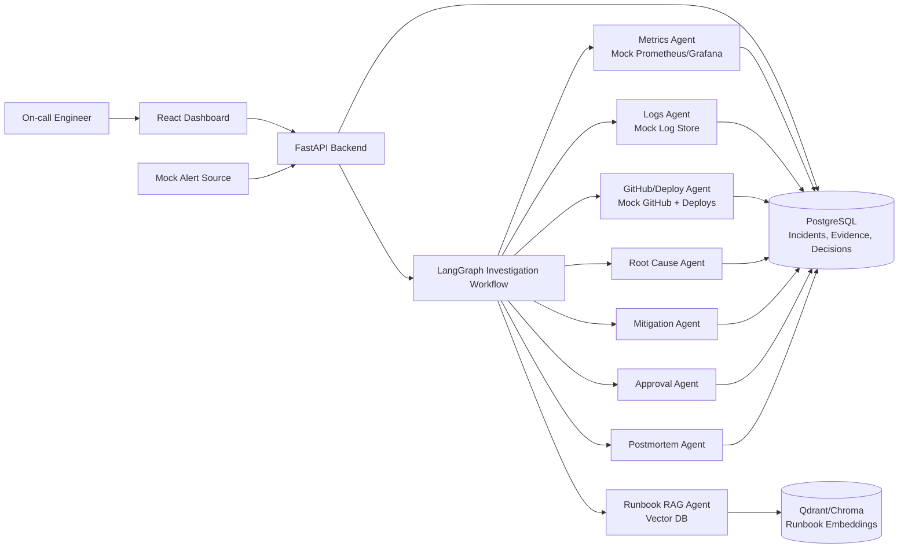
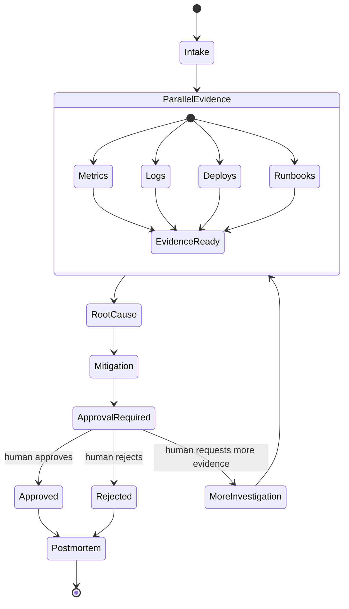

# System Design Architecture

## 1. Architecture Summary

Agentic AI Incident Commander is a local-first MVP built around a LangGraph investigation workflow. A FastAPI backend receives alerts, stores incidents, invokes agents, and exposes data to a React dashboard. Mock observability services provide logs, metrics, traces, deployments, and GitHub context. Runbooks are embedded into a vector store for RAG-based retrieval.

The architecture is designed to demonstrate production-style incident response without needing real infrastructure access.

## 2. Technology Stack

- **Frontend:** React dashboard
- **Backend:** FastAPI
- **Agent orchestration:** LangGraph
- **Database:** PostgreSQL
- **Vector database:** Qdrant or Chroma
- **Mock integrations:** Prometheus/Grafana/Datadog-style metrics, application logs, deployment history, GitHub metadata
- **Containerization:** Docker and Docker Compose
- **LLM provider:** OpenAI-compatible model interface

## 3. High-Level Architecture

## 4. Core Services

### Alert Ingestion API

Receives alert payloads and creates incident records.

Primary endpoints:

- `POST /alerts`: ingest a mock alert and start investigation.
- `GET /incidents`: list incidents.
- `GET /incidents/{incident_id}`: fetch incident details.
- `GET /incidents/{incident_id}/timeline`: fetch investigation timeline.

### Investigation Orchestrator

Runs the LangGraph workflow for each incident.

Responsibilities:

- Maintain shared incident state.
- Call each specialist agent in a controlled order.
- Persist intermediate evidence and decisions.
- Pause for human approval when a risky action is proposed.
- Resume workflow after approval or rejection.

### Evidence Store

Stores normalized evidence from metrics, logs, deployments, GitHub commits, runbooks, hypotheses, and user decisions.

Evidence should include:

- Source type
- Timestamp
- Summary
- Raw payload reference
- Confidence
- Relevance score

### Vector Search Service

Indexes runbooks and retrieves relevant sections for the active incident.

Runbook examples:

- Checkout API latency runbook
- Payment provider timeout runbook
- Database connection pool runbook
- Safe rollback procedure

### Approval Workflow

Handles human approval for risky recommendations.

Primary endpoints:

- `POST /incidents/{incident_id}/approvals`: approve or reject a recommended action.
- `GET /incidents/{incident_id}/recommendations`: list mitigation recommendations.

### Report Generator

Generates postmortems from incident state, evidence, timeline, and approval decisions.

Primary endpoint:

- `GET /incidents/{incident_id}/postmortem`: fetch generated Markdown postmortem.

## 5. Agent Responsibilities

### Alert Intake Agent

- Parses alert severity, service, metric, timestamp, and suspected impact.
- Converts raw alert into normalized incident state.
- Determines which investigation branches should run.

### Metrics Agent

- Queries mocked metrics for latency, error rate, throughput, CPU, memory, and database pool usage.
- Identifies anomalies around the alert window.
- Produces metric evidence summaries.

### Logs Agent

- Searches mocked service logs for error spikes and repeated failure signatures.
- Extracts relevant log examples.
- Groups errors by type, service, and time window.

### GitHub/Deploy Agent

- Checks recent deployments.
- Retrieves related commit messages, changed files, and release metadata.
- Flags suspicious changes close to the incident start time.

### Runbook RAG Agent

- Retrieves runbook sections relevant to the alert and evidence.
- Returns cited procedures, known failure modes, and mitigation guidance.

### Root Cause Agent

- Synthesizes metrics, logs, deployment data, GitHub context, and runbooks.
- Produces ranked hypotheses with evidence citations.
- Marks unknowns and conflicting evidence.

### Mitigation Agent

- Converts root-cause hypotheses into actionable options.
- Ranks rollback, scaling, feature flag disablement, payment-provider failover, and monitor-only actions.
- Adds risk, confidence, expected impact, and approval requirement.

### Approval Agent

- Pauses risky actions until a human decision is captured.
- Records approve, reject, or request-more-investigation decisions.
- Updates incident timeline.

### Postmortem Agent

- Generates a structured postmortem after investigation.
- Includes timeline, impact, root cause, mitigation, follow-up actions, and unresolved questions.

## 6. LangGraph Workflow

## 7. Deployment Model

The MVP runs locally with Docker Compose:

- `frontend`: React dashboard
- `api`: FastAPI backend
- `postgres`: incident and evidence storage
- `vector-db`: Qdrant or Chroma
- `mock-services`: seeded metrics, logs, deployments, GitHub data, and alert fixtures

No real production infrastructure is required for the MVP.
