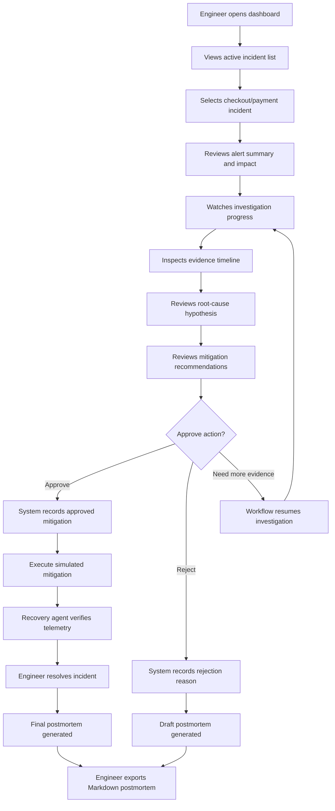

# User Flow

## 1. User Flow Summary

The primary user is an on-call engineer responding to a checkout/payment incident. The user opens the dashboard, reviews the incident, watches the agentic investigation progress, inspects evidence, approves or rejects a mitigation, executes the safe simulation, verifies recovery, resolves the incident, and exports a final postmortem.

## 2. Primary User Journey

## 3. Dashboard Views

### Incident List

Purpose:

- Show all current and recent incidents.
- Help the engineer quickly identify severity and status.

Displayed fields:

- Incident title
- Affected service
- Severity
- Status
- Created time
- Current investigation stage
- Top suspected cause when available

Expected actions:

- Open incident details.
- Filter by status or severity.

### Active Investigation View

Purpose:

- Show what the agents are doing in real time.

Displayed sections:

- Alert summary
- Current stage
- Agent step progress
- Evidence count by source
- Latest investigation notes

Expected actions:

- Refresh incident status.
- Open evidence timeline.
- Jump to recommendations when ready.

### Evidence Timeline

Purpose:

- Let the user understand why the system reached a conclusion.

Displayed evidence:

- Metrics anomalies
- Log error patterns
- Recent deployments
- Suspicious GitHub commits
- Relevant runbook sections
- Human approval decisions

Expected actions:

- Expand evidence details.
- Copy evidence summary.
- Compare evidence timestamps.

### Recommendation Panel

Purpose:

- Present mitigation options clearly and safely.

Displayed fields:

- Recommended action
- Confidence
- Risk level
- Expected impact
- Supporting evidence
- Approval requirement

Example recommendations:

- Roll back checkout service to previous deployment.
- Increase database connection pool size.
- Disable new payment retry feature flag.
- Monitor only because evidence is insufficient.

Expected actions:

- Approve recommendation.
- Reject recommendation.
- Request more investigation.

### Approval Modal

Purpose:

- Prevent accidental execution of risky actions.

Displayed information:

- Selected recommendation
- Risk level
- Evidence summary
- What will be recorded in the demo
- Optional decision reason

Expected actions:

- Approve.
- Reject.
- Cancel.

Current behavior:

- Approval records the decision and marks the mitigation as accepted in the incident timeline.
- The system does not execute real infrastructure changes.

Deployment-ready target:

- Approval resumes the LangGraph workflow from a checkpoint.
- Risky actions remain dry-run or recommendation-only unless an explicit real integration is added later.

### Postmortem View

Purpose:

- Show the final incident report.

Displayed sections:

- Executive summary
- Customer impact
- Timeline
- Root cause
- Mitigation decision
- Evidence used
- Follow-up actions
- Open questions

Expected actions:

- Export Markdown.
- Copy report.
- Reopen incident if needed.

## 4. System Responses By User Action

| User Action | System Response |
| --- | --- |
| Submit or receive mock alert | Creates incident and starts LangGraph workflow |
| Open incident | Shows current status, alert summary, and timeline |
| Wait during investigation | Shows agent progress and newly collected evidence |
| Review recommendation | Shows ranked actions with confidence and risk |
| Approve mitigation | Records approval and unlocks simulated execution |
| Reject mitigation | Records rejection and still generates postmortem |
| Request more investigation | Resumes evidence collection workflow |
| Execute mitigation | Stores simulated action steps and before/after telemetry |
| Monitor recovery | Checks telemetry against recovery thresholds |
| Resolve incident | Closes the incident after verified recovery |
| Export postmortem | Downloads or displays Markdown report |

## 5. Demo Script

1. Start the local app. In the deployment-ready version, start it with Docker Compose.
2. Open the React dashboard.
3. Trigger a mock checkout latency alert.
4. Open the new incident.
5. Watch agents collect metrics, logs, deployment, GitHub, and runbook evidence.
6. Review the root-cause hypothesis.
7. Approve the safest mitigation.
8. Execute the approved mitigation simulation.
9. Verify recovery telemetry.
10. Resolve the incident.
11. Open and export the final Markdown postmortem.

## 6. User Experience Principles

- Keep the dashboard evidence-first, not chatbot-first.
- Show why the agent believes something before showing the recommendation.
- Make risky actions visibly approval-gated.
- Keep the incident timeline readable for technical and non-technical stakeholders.
- Avoid claiming certainty when evidence is incomplete.
